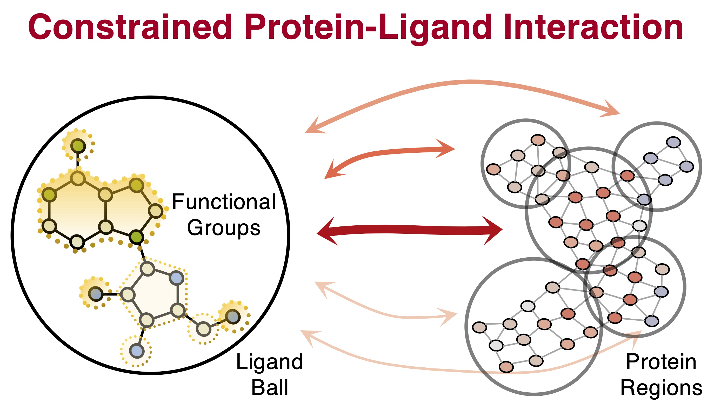

## PSICHIC: physicochemical graph neural network for learning protein-ligand interaction fingerprints from sequence data
| [Preprint](https://www.biorxiv.org/content/10.1101/2023.09.17.558145v1) | [Dataset](https://drive.google.com/drive/folders/1ZRpnwXtllCP89hjhfDuPivBlarBIXnmu?usp=sharing) | 

## Virtual Screening Platform <a href="https://colab.research.google.com/github/huankoh/PSICHIC/blob/main/PSICHIC.ipynb" target="_parent"></a>

- **Only Sequence Data**: Protein Sequence + Ligand SMILES pairs is all you need.
- **Quick Screening**: Up to 100K compounds in an hour.
- **Deep Analysis**: Uncover molecular insights with PSICHIC-powered pharmacophore and targeted mutagenesis analysis.

_Start exploring. Your next discovery could be just clicks away!_
## Conceptual Framework


## Environment Setup
```
conda install pytorch==2.0.0 torchvision==0.15.0 torchaudio==2.0.0 pytorch-cuda=11.7 -c pytorch -c nvidia
conda install pyg -c pyg
conda install -c conda-forge rdkit==2022.09.5
pip install scipy biopython pandas biopandas timeout_decorator py3Dmol umap-learn plotly mplcursors lifelines reprint
pip install "fair-esm"
```

## BYO-PSICHIC with Annotated Sequence Data 

Create a train, valid and test csv file in a datafolder (for examples, see the dataset folder). The datafolder should contain at least a train.csv and test.csv file. Depending on your annotated labels, you want to use ``--regression_task True`` if it is a continuous value label (e.g., binding affinity), ``--classification_task True`` if it is a binary class label (e.g., presence of interaction) and ``--mclassification_task C`` where C represents the number of classes in your multiclass labels (e.g., 3 if you are using our protein-ligand functional response dataset). Note, you can have a dataset with multiple label types and we will train PSICHIC on predicting multiple protein-ligand interaction properties (see PSICHIC-MultiTask below)
```
python main.py --datafolder annotated_folder --result_path result/annotated_result --regression_task True 
```

BYO-PSICHIC using a benchmark dataset, for example, the PDBBind v2020 benchmark:
```
python main.py --datafolder pdb2020 --result_path result/PDB2020_BENCHMARK --regression_task True 
```
Model and optimizer configurations are consistent across all benchmark datasets, except PDBBind v2016 where you want to change the optimizer's number of training iterations, betas and eps to 30000, "(0.9,0.99)" and 1e-5 respectively, i.e. add to the commandline: ``--total_iters 30000 --betas "(0.9,0.99)" --eps 1e-5``. For binary classification task, replace ``--regression_task True`` to ``--classification_task True``. For protein functional effect dataset, replace ``--regression_task True`` to ``--mclassification_task 3``. Feel free to adjust the model hyperparameters in the config.json file, let us know if you find any interesting results!
 
## PSICHIC-MultiTask: Pretrain-then-Finetune 
### Pre-train PSICHIC
```
python main.py --datafolder dataset/large_scale_interaction_dataset --result_path PSICHIC_MultiTask_Pretrain --lrate 1e-5 --sampling_col pretrain_sampling_weight --regression_task True --mclassification_task 3 --total_iters 300000 --evaluate_step 25000
```
### Fine-tune PSICHIC
We finetune only the functional effect classification head of the pre-trained PSICHIC for 1000 iteration on A1R related protein using the following command:
```
python main.py --regression_task True --mclassification_task 3 --datafolder dataset/A1R_FineTune --result_path PSICHIC_A1R_FineTune --lrate 1e-5 --total_iters 1000 --finetune_modules "['mcls_out']" --trained_model_path trained_weights/multitask_PSICHIC
```

For any other proteins, you can filter out irrelevant proteins and the non-binders in large-scale interaction dataset to apply PSICHIC for other experiments.

### Manuscript Experiment
If you want to reproduce our results shown in the manuscript: download all files (including datasets) from [zenodo](https://zenodo.org/record/8347859). Scripts for annotating PDB b-factors (used in PyMOL visualisation) is available in the Virtual Screening Colab notebook above.


## References

For more information, please refer to our work: 

```
PSICHIC: physicochemical graph neural network for learning protein-ligand interaction fingerprints from sequence data
Huan Yee Koh, Anh T.N. Nguyen, Shirui Pan, Lauren T. May, Geoffrey I. Webb
bioRxiv 2023.09.17.558145; doi: https://doi.org/10.1101/2023.09.17.558145
```
